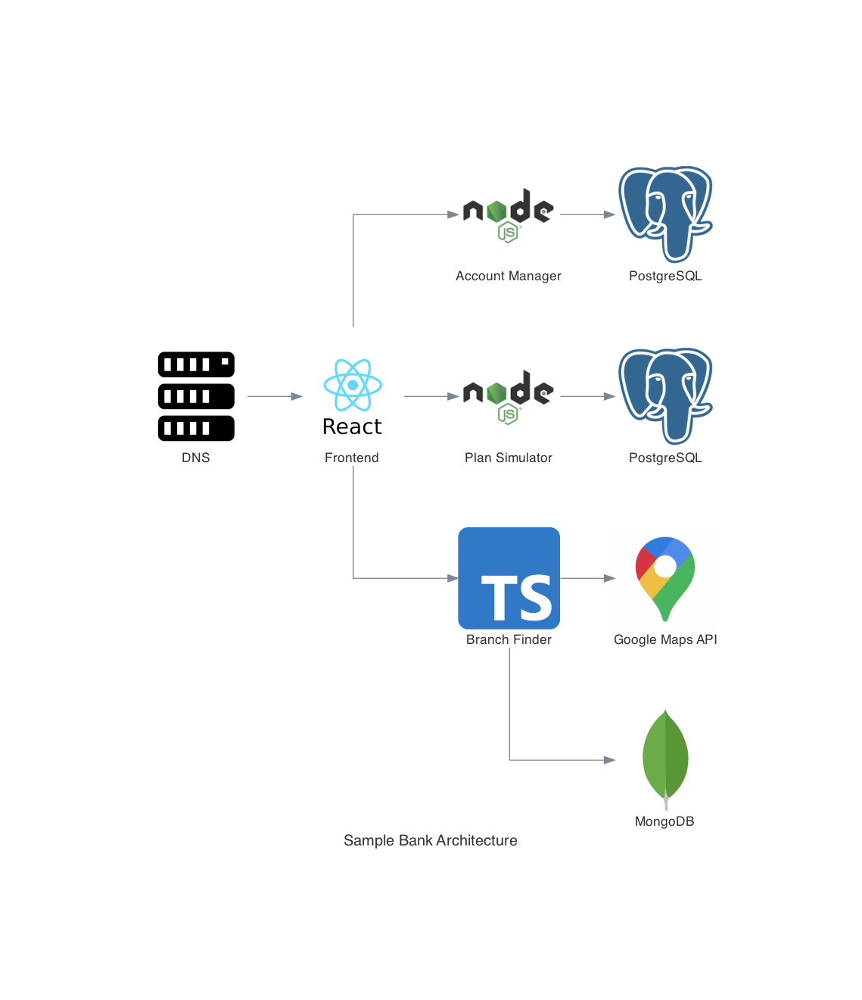

# Sample Bank

## Architecture

This application is structured as a monorepo, which means that all services (backend and frontend) sit under the same Github repository.

**Services**
- Account Manager: Transfer and get balance of Savings and Checking accounts
- Account Type Simulator: Check the cheapest account type based on your needs
- Branch Finder: Find the nearest branch to your location
- Frontend: application interface

## Live Demo

Credentials:  
Branch: 0001   
Account number: 12345   
Password: Qwerty@123  

[Access Live Demo](http://amirelemam.com.s3-website-us-east-1.amazonaws.com/)  

## Requirements

- Node.js 12 or later
- AWS account and awscli. To install awscli [click here](https://aws.amazon.com/cli)
- Docker (optional)

## Run

You can run all services with docker-compose  
`$ docker-compose up --build`

## Backend

### Account Manager

**Features**  
- Transfer money between accounts  
- Get balance for Savings and Checking accounts  

**Stack**
- Node.js
- Jest
- PostgreSQL

**External Services**
- PostgreSQL

**Environment Variables**
- DB_HOST: Postgres host
- DB_USER: Postgres user
- DB_PASSWORD: Postgres password
- DB_NAME: Postgres DB name

**Docs**

OpenAPI (former Swagger) `/api/docs`  

**Run**

- Docker (recommended)  
  Add permission to execute the script  
  `$ chmod +x startAccountManagerWithDocker.sh`  
  Run the script  
  `$ ./startAccountManagerWithDocker`

- Local  
  Go to the service folder  
  `$ cd backend/account-manager`  
  Install dependencies  
  `$ npm install`  
  Run tests  
  `$ npm test`  
  Start service  
  `$ npm run start:local`

- Production  
  Go to the service folder  
  `$ cd backend/account-manager`  
  Install dependencies  
  `$ npm install --only=prod`  
  Run tests  
  `$ npm test`  
  Start service  
  `$ npm start`

### Account Type Simulator

**Features**  
- Simulate which account type is cheaper for your needs: Pro or Free
- Get pricing for all account types 

**Stack**
- Node.js
- Jest
- PostgreSQL

**External Services**
- PostgreSQL

**Environment Variables**
- DB_HOST: Postgres host
- DB_USER: Postgres user
- DB_PASSWORD: Postgres password
- DB_NAME: Postgres DB name

**Docs**

OpenAPI (former Swagger) `/api/docs`  

**Run**

- Docker (recommended)  
  Add permission to execute the script  
  `$ chmod +x startAccountTypeSimulatorWithDocker.sh`  
  Run the script  
  `$ ./startAccountTypeSimulatorWithDocker`

- Local  
  Go to the service folder  
  `$ cd backend/account-type-simulator`  
  Install dependencies  
  `$ npm install`  
  Run tests  
  `$ npm test`  
  Start service  
  `$ npm run start:local`

- Production  
  Go to the service folder  
  `$ cd backend/account-type-simulator`  
  Install dependencies  
  `$ npm install --only=prod`  
  Run tests  
  `$ npm test`  
  Start service  
  `$ npm start`

### Branch Finder

**Stack**
- Typescript
- Jest
- MongoDB

**External Services**
- MongoDB
- Google Maps API

**Features**  
- Find the nearest branch to the given location (latitude, longitude).  

**Environment Variables**
- DB_CONN_STR: MongoDB connection string

**Docs**

OpenAPI (former Swagger) `/api/docs`  

**Run**

- Docker (recommended)  
  Add permission to execute the script  
  `$ chmod +x startBranchFinderWithDocker.sh`  
  Run the script  
  `$ ./startBranchFinderWithDocker`

- Local  
  Go to the service folder  
  `$ cd backend/branch-finder`  
  Install dependencies  
  `$ npm install`  
  Run tests  
  `$ npm test`  
  Start service  
  `$ npm run start:local`

- Production  
  Go to the service folder  
  `$ cd backend/branch-finder`  
  Install dependencies  
  `$ npm install --only=prod`  
  Run tests  
  `$ npm test`  
  Start service  
  `$ npm start`

## Frontend

**Stack**
- React.js
- Material UI

**Environment Variables**
- GOOGLE_MAPS_API_KEY: Google Maps key
- ACCOUNT_MANAGER_API: Account Manager backend URL
- ACCOUNT_TYPE_SIMULATOR_API: Account Type Simulator backend URL
- BRANCH_FINDER_API: Branch Finder backend URL

**Run**

- Docker (recommended)  
  Add permission to execute the script  
  `$ chmod +x startFrontendWithDocker.sh`  
  Run the script  
  `$ ./startFrontendWithDocker`

- Local  
  Go to the service folder  
  `$ cd frontend`  
  Install dependencies  
  `$ npm install`  
  Run tests  
  `$ npm test`  
  Start service  
  `$ npm run start:local`

<!-- 
### CI/CD

### Deploy
-->

## License

These files are licensed under the [MIT License](LICENSE)
